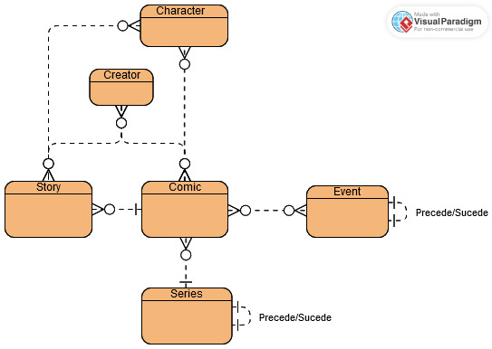

# Desafio Técnico Aleon

Acesse [aqui](https://github.com/eduardafneumann/desafio-tecnico-aleon) esse projeto no GitHub.

O contaúdo desse repositório é minha proposta de solução ao desafio técnico do programa de estágio da empresa Aleon AI.

## Decisões tomadas durante o projeto

A API escolhida para a extração dos dados foi [Marvel](https://developer.marvel.com), devido à grande possibilidades de análises possíveis, já que é uma grande base de dados, e para a demonstração do uso e administração de chaves privadas.

A biblioteca usada para a visualização dos dados será [Vega Altair](https://altair-viz.github.io), devido à sua grande possíbilidade de customização de gráficos e visualização iterativa.

## Execução

Para executar o projeto, crie um ambiente virtual Python, ative-o e instale as dependências. Utilize esses comandos no sistema Windows:

```
python -m venv venv
.\venv\Scripts\activate.bat
pip install -r requirements.txt
```

E esses nos sistemas Linux:

```
python -m venv venv
source venv/bin/activate
pip install -r requirements.txt
```

Feito isso, use a sua interface de escolha para executar o Jupyter Notebook (como VSCode ou navegador web). 

Para executar a extração dos dados, é necessário criar um arquivo ".env" na diretório raíz e incluir a chave da API e a chave privada, que podem ser criadas [aqui](https://developer.marvel.com/). O arquivo deve ter o formato:

```
PUB_KEY = "<sua-chave-publica>"
PRIV_KEY = "<sua-chave-privada>"
```

## Detalhes da API

A API possui 6 endpoints para extração dos recursos da base de dados (além de endpoints para consulta de recursos individuais por ID). São eles:

* creators
* series
* stories
* comics
* characters
* events

Durante a extração dos dados, foram limitadas quantas instâncias de cada recurso seriam coletadas devido à latência da API e à limitação de chamadas diárias que podem ser feitas pela mesma chave. Com limite máximo de 1000 instâncias por recurso (existem menos de 1000 events na base de dados), a extração durou cerca de 25 minutos. 

O limite de instâncias por pacotes foi mantido no padrão 20 (porém a classe DataExtractor é estruturada para que, deseje-se alterar isso, basta alterar o atributo privado __limit), pois durante os testes um pacote com limite 100 possuia latência maior do que 5 pacotes com limite 20.

### Formatação de URL

As URLs para acesso a essa API têm o seguinte formato:

```
"http://gateway.marvel.com/v1/public/<endpoint>?ts=<timestamp>&apikey=<chave-publica>&hash=<hash>&limit=<limite>&offset=<offset>"
```

* _endpoint_ é um dos 6 recursos citados acima
* _timestamp_ é o timestamp do momento em que a requisição é feita (ou preparada)
* _apikey_ é a sua chave pública (que foi adicionada ao arquivo ".env")
* _hash_ é uma hash MD5 de uma string composta pelo timestamp, chave pública e chave privada, nessa ordem
* _limite_ é a quantidade máxima de instâncias que podem ser retornadas em cada pacote pela API, o máximo é 100
* _offset_ é a partir de qual instância devem começar os resultados para o request

## Detalhes dos dados transformados

Os dados retornados pela API foram tratados, convertidos para objetos pandas.DataFrame e salvos em formato parquet. O conjunto de DataFrames foi estruturado como uma base de dados relacional. Cada um dos recursos citados na seção anterior tem sua própria tabela. Além disso, muitos recursos possuem relação de muitos-para-muitos, portanto foram criadas tabelas auxiliares para armazenar essas relações. 

### Diagrama de entidade relacionamento



Uma _story_ é uma parte de uma _comic_, geralmente uma página especial, porém existem partes da _comic_ que não são uma _story_. Toda _series_ e _event_ são compostas apenas por _comics_, portanto são definidas pelas _comics_ que a compõe. Uma _comic_ pode pertencer apenas a uma _series_, porém pode pertencer a diversos _events_.

Um _creator_ e um _character_ podem ser relacionados a várias _comics_ e _stories_, e cada _comic_ e _story_ pode ser relacionada a vários _characters_ e _creators_. Não seria suficiente atrelar _creator_ e _character_ apenas a _story_, pois existem partes da _comic_ que não são uma _story_, nem apenas a _comic_, pois perde-se a informação do que é relacionado apenas com a _story_ e não com a _comic_ inteira (quem desenhou apenas a _story_ e não o resto da _comic_, por exemplo).

### Esquemas

Os esquemas das tabelas referentes aos recursos da API são descritos abaixo:

```
CREATE TABLE character (
    id INT PRIMARY KEY,
    name VARCHAR(255),
    modified TIMESTAMP
);

CREATE TABLE comic (
    id INT PRIMARY KEY,
    title VARCHAR(255),
    issueNumber INT,
    modified TIMESTAMP,
    pageCount INT,
    saleDate TIMESTAMP,
    focDate TIMESTAMP,
    printPrice DECIMAL(10, 2),
    digitalPrice DECIMAL(10, 2)
    FOREIGN KEY (series) REFERENCES series (id)
);

CREATE TABLE creator (
    id INT PRIMARY KEY,
    fullName VARCHAR(255),
    modified TIMESTAMP
);

CREATE TABLE event (
    id INT PRIMARY KEY,
    title VARCHAR(255),
    modified TIMESTAMP,
    start TIMESTAMP,
    end TIMESTAMP,
    FOREIGN KEY (previous) REFERENCES event (id),
    FOREIGN KEY (next) REFERENCES event (id)
);

CREATE TABLE series (
    id INT PRIMARY KEY,
    title VARCHAR(255),
    startYear INT,
    endYear INT,
    rating VARCHAR(255),
    type VARCHAR(255),
    modified TIMESTAMP,
    FOREIGN KEY (previous) REFERENCES series (id),
    FOREIGN KEY (next) REFERENCES series (id)
);

CREATE TABLE story (
    id INT PRIMARY KEY,
    title VARCHAR(255),
    modified TIMESTAMP,
    FOREIGN KEY (comic) REFERENCES comic (id)
);
```

E os esquemas referentes às tabelas auxiliares:

```
CREATE TABLE character_in_comic (
    FOREIGN KEY (character) REFERENCES character (id),
    FOREIGN KEY (comic) REFERENCES comic (id)
    PRIMARY KEY (character, comic)
);

CREATE TABLE character_in_story (
    FOREIGN KEY (character) REFERENCES character (id),
    FOREIGN KEY (story) REFERENCES story (id)
    PRIMARY KEY (character, story)
);

CREATE TABLE creator_of_comic (
    FOREIGN KEY (creator) REFERENCES creator (id),
    FOREIGN KEY (comic) REFERENCES comic (id)
    PRIMARY KEY (creator, comic)
);

CREATE TABLE creator_of_story (
    FOREIGN KEY (creator) REFERENCES creator (id),
    FOREIGN KEY (story) REFERENCES story (id)
    PRIMARY KEY (creator, story)
);

CREATE TABLE comic_in_event (
    FOREIGN KEY (comic) REFERENCES comic (id),
    FOREIGN KEY (event) REFERENCES event (id)
    PRIMARY KEY (comic, event)
);
```